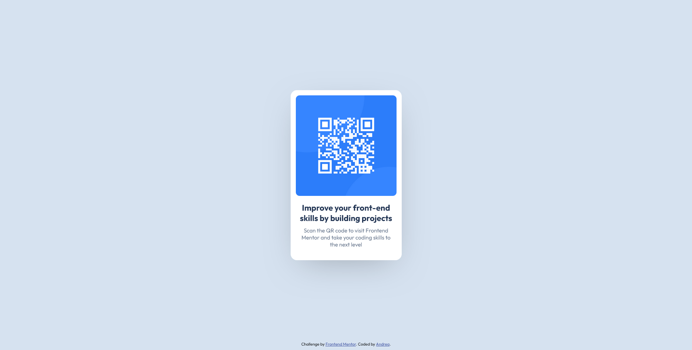
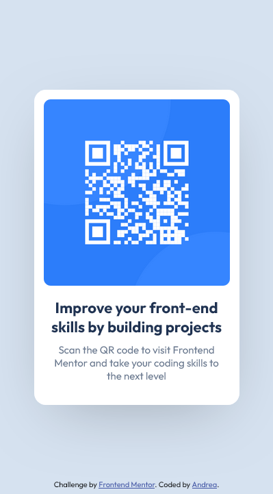

# Frontend Mentor - Soluzione Componente QR Code

Questa è la soluzione alla challenge del componente QR code di [Frontend Mentor](https://www.frontendmentor.io/challenges/qr-code-component-iux_sIO_H). Le challenge di Frontend Mentor ti aiutano a migliorare le tue competenze di coding costruendo progetti realistici.

This is a solution to the [QR code component challenge on Frontend Mentor](https://www.frontendmentor.io/challenges/qr-code-component-iux_sIO_H). Frontend Mentor challenges help you improve your coding skills by building realistic projects. 

## Table of contents

- [Overview](#overview)
  - [Screenshot](#screenshot)
  - [Links](#links)
- [My process](#my-process)
  - [Built with](#built-with)
  - [What I learned](#what-i-learned)
  - [Continued development](#continued-development)
  - [Author](#author)

## Overview

Questo progetto è la soluzione alla challenge del componente QR code di Frontend Mentor. L'obiettivo era costruire un componente QR code responsivo utilizzando HTML e CSS, replicando fedelmente il design fornito. È stata un'ottima occasione per mettere in pratica le basi dello sviluppo front-end.

This project is a solution to the Frontend Mentor QR code component challenge. The goal was to build a responsive QR code component using HTML and CSS, faithfully replicating the provided design. It was a great opportunity to practice front-end development fundamentals.

### Screenshot

### Links

- Solution URL: [Repo Github](https://github.com/Andechera/Andechera.github.io)
- Live Site URL: [Github Page](https://andechera.github.io/)

## My process

Ho affrontato questa challenge con un approccio abbastanza sistematico. Prima di tutto, mi sono concentrato sull'HTML, cercando di dare una struttura solida e semantica al componente. L'idea era di avere una base chiara prima di passare allo styling. Poi, mi sono buttato a capofitto nel CSS, usando quello che mi sembrava più adatto per replicare il design. C'è stato un piccolo refactoring a metà strada: mi sono accorto che raggruppare l'h1 e il p in un div (o section, a seconda del contesto) rendeva lo styling più pulito ed efficace. Un bel trucco per tenere tutto in ordine!

I tackled this challenge with a pretty systematic approach. First off, I focused on the HTML, aiming for a solid, semantic structure for the component. The idea was to have a clear foundation before diving into styling. Then, I jumped headfirst into the CSS, using whatever felt most appropriate to replicate the design. There was a small refactoring midway: I realized that grouping the h1 and p within a div (or section, depending on the context) made the styling cleaner and more effective. A neat trick to keep everything tidy!

### Built with

- Markup HTML5 semantico
- Proprietà CSS personalizzate
- Flexbox
- Approccio mobile-first

- Semantic HTML5 markup
- CSS custom properties
- Flexbox
- Mobile-first workflow

### What I learned

Questa challenge mi ha permesso di approfondire la mia conoscenza del CSS vanilla. Ho cercato di usare le proprietà che mi sembravano più adatte per ogni situazione, senza appoggiarmi a framework. È stato un ottimo modo per consolidare le basi e capire meglio come funzionano le cose "sotto il cofano". Ho anche rafforzato l'importanza della semantica HTML, che rende il codice più leggibile e accessibile.

This challenge allowed me to deepen my understanding of vanilla CSS. I tried to use the properties that seemed most suitable for each situation, without relying on frameworks. It was a great way to solidify the basics and better understand how things work "under the hood." I also reinforced the importance of semantic HTML, which makes the code more readable and accessible.

### Continued development

Ho intenzione di continuare a migliorare le mie competenze CSS, specialmente per quanto riguarda il responsive design e le tecniche di layout avanzate.

I plan to continue improving my CSS skills, especially with responsive design and advanced layout techniques.

## Author

- Frontend Mentor - [@Andechera](https://www.frontendmentor.io/profile/Andechera)